# RAG System Architecture Documentation

## Overview

This document explains the Retrieval-Augmented Generation (RAG) system implemented for the RuPay agent. The system follows proper RAG architecture with clear separation between offline knowledge preparation and online query processing.

## System Architecture

```mermaid
graph TB
    subgraph Offline["🔧 OFFLINE PHASE (Run Once)"]
        A[📄 Load Documents<br/>PDF/TXT] --> B[✨ Clean Text<br/>Normalize]
        B --> C[✂️ Token-Based Chunking<br/>400-800 tokens<br/>15% overlap]
        C --> D[🧮 Generate Embeddings<br/>SentenceTransformer]
        D --> E[💾 FAISS Index<br/>+ Metadata Storage]
    end
    
    subgraph Online["⚡ ONLINE PHASE (Per Query)"]
        F[❓ User Question] --> G[🔍 Preprocess<br/>Normalize Query]
        G --> H[🧮 Query Embedding]
        H --> I[🎯 Vector Search<br/>Top-20 Candidates]
        I --> J[📊 Re-Ranking<br/>Hybrid Scoring]
        J --> K[📝 Context Construction<br/>Token Budget]
        K --> L[🤖 LLM Generation<br/>Strict RAG Prompting]
        L --> M[✅ Final Answer]
    end
    
    Offline -.->|Index Ready| Online
```



## Two-Phase Design

### Phase 1: Offline Knowledge Preparation

**Purpose**: Prepare documents for retrieval (run once or when documents change)

**Components**:

1. **Document Loading** ([offline_ingestion.py](file:///c:/Users/admin/Desktop/Rupay_agent/core/offline_ingestion.py))
   - Supports PDF and TXT formats
   - Extracts raw text from documents
   - Handles multiple documents in a directory

2. **Text Cleaning**
   - Removes excessive whitespace
   - Normalizes special characters
   - Ensures clean input for chunking

3. **Token-Based Chunking**
   - **Chunk Size**: 400-800 tokens (default 600)
   - **Overlap**: 15% (~90 tokens)
   - Uses `tiktoken` with `cl100k_base` encoding
   - Ensures semantic coherence within chunks

4. **Embedding Generation**
   - Model: `all-MiniLM-L6-v2` (384 dimensions)
   - Fast and efficient for semantic search
   - Generates dense vector representations

5. **FAISS Storage**
   - Index Type: `IndexFlatL2` (L2 distance)
   - Stores embeddings for fast similarity search
   - Metadata stored separately in pickle format

**Files Created**:
- `data/rupay_faiss.index` - FAISS vector index
- `data/rupay_metadata.pkl` - Chunk metadata (text, document ID, token count)

---

### Phase 2: Online Query Processing

**Purpose**: Answer user questions using retrieved context (runs per query)

**Components**:

1. **Question Preprocessing** ([online_retrieval.py](file:///c:/Users/admin/Desktop/Rupay_agent/core/online_retrieval.py))
   - Normalizes whitespace
   - Standardizes question format
   - Optional query rewriting (future enhancement)

2. **Vector Similarity Search**
   - Converts question to embedding
   - Searches FAISS index for top-K candidates
   - Initial retrieval: Top-20 candidates

3. **Re-Ranking** ⭐ **Key Innovation**
   - **Hybrid Scoring**:
     - Vector Similarity (70%): Semantic relevance
     - Keyword Overlap (30%): Exact term matching
   - Filters by minimum score threshold (0.3)
   - Reduces to top-5 most relevant chunks

4. **Context Construction**
   - Assembles chunks into context string
   - Respects token budget (max 3000 tokens)
   - Formats as numbered passages

5. **LLM Generation** ([rag_generation.py](file:///c:/Users/admin/Desktop/Rupay_agent/core/rag_generation.py))
   - **Strict RAG Prompting**:
     ```
     "Answer only using the provided context.
      If the answer is not in the context, say:
      'I don't have enough information.'"
     ```
   - **Low Temperature**: 0.2 (deterministic responses)
   - **Model**: Gemini 1.5 Flash
   - Prevents hallucination by enforcing context-only answers

## Code Structure

```
core/
├── rag_config.py           # Centralized configuration
├── offline_ingestion.py    # Offline phase: Document → Vectors
├── online_retrieval.py     # Online phase: Query → Context
├── rag_generation.py       # Online phase: Context → Answer
└── rag_pipeline.py         # Main orchestrator

agents/
└── agent_rag.py            # Agent interface for main system
```

## Configuration

All parameters are centralized in [rag_config.py](file:///c:/Users/admin/Desktop/Rupay_agent/core/rag_config.py):

| Parameter | Value | Purpose |
|-----------|-------|---------|
| `EMBEDDING_MODEL_NAME` | `all-MiniLM-L6-v2` | Embedding model |
| `DEFAULT_CHUNK_SIZE` | 600 tokens | Target chunk size |
| `CHUNK_OVERLAP` | 90 tokens (15%) | Overlap between chunks |
| `INITIAL_RETRIEVAL_K` | 20 | Candidates before re-ranking |
| `RERANK_TOP_K` | 5 | Final chunks after re-ranking |
| `RERANK_MIN_SCORE` | 0.3 | Minimum relevance score |
| `LLM_TEMPERATURE` | 0.2 | Low for deterministic answers |
| `MAX_CONTEXT_TOKENS` | 3000 | Max context sent to LLM |

## Usage Examples

### 1. Offline Ingestion (One-Time Setup)

```python
from core.offline_ingestion import OfflineIngestion

# Initialize ingestion
ingestion = OfflineIngestion()

# Ingest a single document
stats = ingestion.ingest_document("data/documents/rupay_guide.pdf")
print(f"Created {stats['num_chunks']} chunks")

# Or ingest entire directory
stats_list = ingestion.ingest_directory("data/documents")

# Save to disk
ingestion.save_index()
```

**Command Line**:
```bash
python core/offline_ingestion.py
```

### 2. Online Query Processing

```python
from core.rag_pipeline import RupayRAG

# Initialize RAG system
rag = RupayRAG()

# Query
result = rag.query("What are the benefits of RuPay?")

print(f"Answer: {result['answer']}")
print(f"Chunks used: {result['num_chunks']}")
```

**Command Line**:
```bash
python core/rag_pipeline.py
```

### 3. Agent Interface (Main System Integration)

```python
from agents.agent_rag import RAGAgent

# Initialize agent
agent = RAGAgent()

# Execute query
response = agent.execute({"query": "What is the transaction limit?"})

# Response is JSON string
import json
result = json.loads(response)
print(result['answer'])
```

## Re-Ranking Algorithm

The re-ranking step improves retrieval quality beyond simple vector search:

### Hybrid Scoring Formula

```python
final_score = (0.7 × vector_similarity) + (0.3 × keyword_score)
```

### Components

1. **Vector Similarity**
   - L2 distance converted to similarity: `1 / (1 + distance)`
   - Range: 0-1 (higher is better)
   - Captures semantic meaning

2. **Keyword Score**
   - Jaccard similarity: `|Q ∩ C| / |Q ∪ C|`
   - Q = question words, C = chunk words
   - Removes stop words
   - Captures exact term matches

### Why Re-Ranking Matters

| Scenario | Vector Search Alone | With Re-Ranking |
|----------|---------------------|-----------------|
| "RuPay transaction limit" | May return general RuPay info | Prioritizes chunks with "transaction" AND "limit" |
| Semantic variations | Handles well | Handles even better |
| Exact term matching | Can miss | Captures explicitly |

## LLM Prompting Strategy

### System Prompt Template

```python
"""You are a helpful assistant that answers questions ONLY using the provided context.

RULES:
1. Only use information from the context below
2. If the answer is not in the context, respond: "I don't have enough information to answer this question."
3. Do not use external knowledge or make assumptions
4. Keep answers concise and factual
5. Quote relevant parts of the context when appropriate

CONTEXT:
{context}

QUESTION:
{question}

ANSWER:"""
```

### Key Design Decisions

1. **Low Temperature (0.2)**: Reduces randomness, increases determinism
2. **Explicit Rules**: Clear instructions to prevent hallucination
3. **Fallback Response**: Standardized "no information" message
4. **Context-First**: Context appears before question to prime the model

## Token Management

### Chunking Strategy

- **Why 400-800 tokens?**
  - Large enough for semantic coherence
  - Small enough for specific retrieval
  - Fits well within LLM context windows

- **Why 15% overlap?**
  - Prevents information loss at chunk boundaries
  - Ensures continuous concepts aren't split
  - Balances redundancy vs coverage

### Context Budget

- **Max Context**: 3000 tokens
- **Fits in any modern LLM** (most support 8k-128k)
- **Leaves room for**: System prompt + question + answer generation

## Performance Characteristics

| Metric | Value |
|--------|-------|
| **Offline Ingestion** | ~30 seconds for 50-page PDF |
| **Online Query** | ~2-3 seconds end-to-end |
| **Embedding Generation** | ~0.5 seconds (5 chunks) |
| **FAISS Search** | <10ms (thousands of chunks) |
| **Re-Ranking** | ~100ms (20 candidates) |
| **LLM Generation** | 1-2 seconds |

## Design Trade-offs

### What We Chose

✅ **FAISS over ChromaDB**: Simpler, local, no dependencies  
✅ **Token-based chunking**: More accurate than character-based  
✅ **Hybrid re-ranking**: Better than pure vector search  
✅ **Strict prompting**: Reduces hallucination risk  
✅ **Modular design**: Easy to understand and extend  

### What We Didn't Include (Deliberately)

❌ **Advanced re-rankers** (e.g., cross-encoders): Too slow for demo  
❌ **Query rewriting**: Adds complexity, marginal benefit  
❌ **Multiple retrievers**: Single method sufficient for demo  
❌ **Caching**: Unnecessary for learning purposes  
❌ **Production features**: Logging, monitoring, auth, etc.  

## Extension Points

Future improvements you can add:

1. **Better Re-Ranking**
   - Use cross-encoder models (e.g., `ms-marco-MiniLM`)
   - Add BM25 hybrid search

2. **Query Enhancement**
   - Query expansion with synonyms
   - Multi-query generation

3. **Chunk Optimization**
   - Semantic chunking (split by paragraphs/topics)
   - Recursive chunking

4. **Better Context**
   - Include surrounding chunks
   - Add document metadata in context

5. **Evaluation**
   - Add test questions with ground truth
   - Calculate precision/recall metrics

## Troubleshooting

### Issue: "FAISS index not found"
**Solution**: Run offline ingestion first:
```bash
python core/offline_ingestion.py
```

### Issue: "No relevant chunks found"
**Cause**: Threshold too high or no matching content  
**Solution**: Lower `RERANK_MIN_SCORE` in config

### Issue: LLM hallucinating answers
**Cause**: Temperature too high or prompt not strict enough  
**Solution**: Already set to 0.2; verify prompt template

### Issue: Slow query processing
**Cause**: Too many initial candidates or large context  
**Solution**: Reduce `INITIAL_RETRIEVAL_K` or `MAX_CONTEXT_TOKENS`

## References

- **Embedding Model**: [Sentence Transformers](https://www.sbert.net/)
- **Vector DB**: [FAISS](https://github.com/facebookresearch/faiss)
- **Tokenizer**: [tiktoken](https://github.com/openai/tiktoken)
- **LLM**: [Google Gemini](https://ai.google.dev/)

---

**Last Updated**: 2026-01-12  
**Architecture Version**: 2.0 (Modular RAG)
